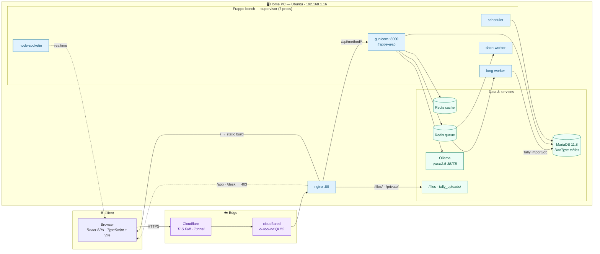
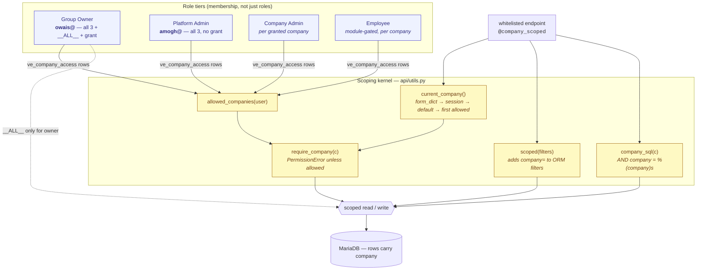
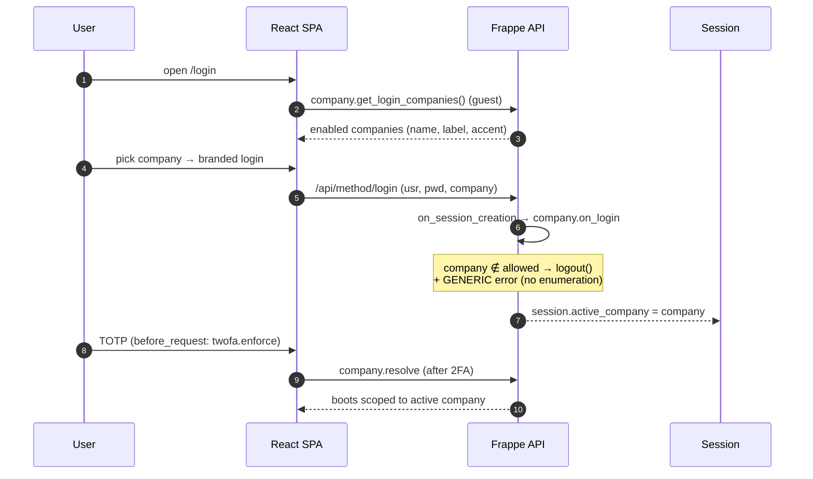
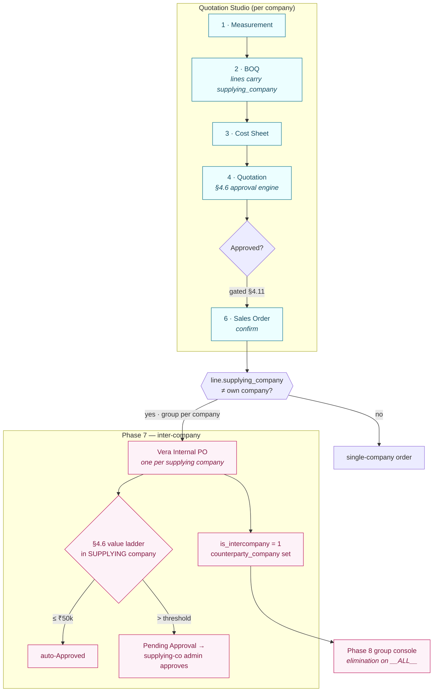
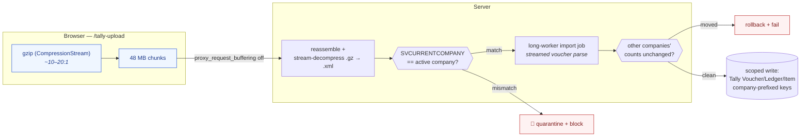
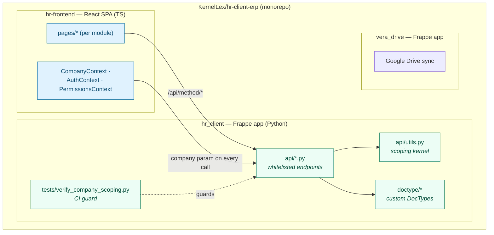

# Vera ERP — Architecture Diagrams

> Visual companion to [`ARCHITECTURE.md`](../ARCHITECTURE.md). Every diagram below is
> [Mermaid](https://mermaid.js.org/) and renders natively on GitHub. One site, one
> database, **three companies** — Vera Enterprises (VE), Schönes Leben (SL),
> Hagan Modular (HM) — served by a single React SPA over a company-scoped API.

Company accents used throughout: **VE** forest/gold · **SL** plum `#6B3F58` · **HM** steel `#2F4858`.

---

## 1. System topology — request to storage

How a browser request reaches data, and every long-lived process behind it.

**No shared type contract.** The SPA calls a dotted Python path and reads
`res.data.message`; the frontend re-declares the shapes each endpoint returns.

---

## 2. The multi-company scoping kernel

Everything siloed flows through one kernel in `hr_client/api/utils.py`. A single
`company` dimension on every siloed DocType; global masters are never scoped.

> **CI guard** (`hr_client/tests/verify_company_scoping.py`) walks every
> `@frappe.whitelist` function and fails the build if one touches siloed data
> without a scoping primitive, an explicit global allowlist entry, or a tracked
> pending-debt entry. **369 scoped · 17 global · 7 tracked · 0 offenders.**

---

## 3. Auth flow — company picker → login → 2FA → scoped app

Wrong-password and no-access-to-company return **byte-identical** messages so
staff↔company membership can't be enumerated.

---

## 4. Quotation Studio — six-stage chain & the Phase 7 inter-company PO

The commercial pipeline, and how confirming a Sales Order raises internal POs to
sibling companies (Phase 7 §3).

---

## 5. Tally import pipeline (Phase 6A) — upload to scoped books

Two files per company (Masters + full Transactions, up to ~1.6 GB), imported
into one company's books without ever crossing into another's.

---

## 6. Repository & module map

---

_See [`ARCHITECTURE.md`](../ARCHITECTURE.md) for the prose deep-dive and
[`HANDOFF_MULTICOMPANY.md`](../HANDOFF_MULTICOMPANY.md) for build status._
